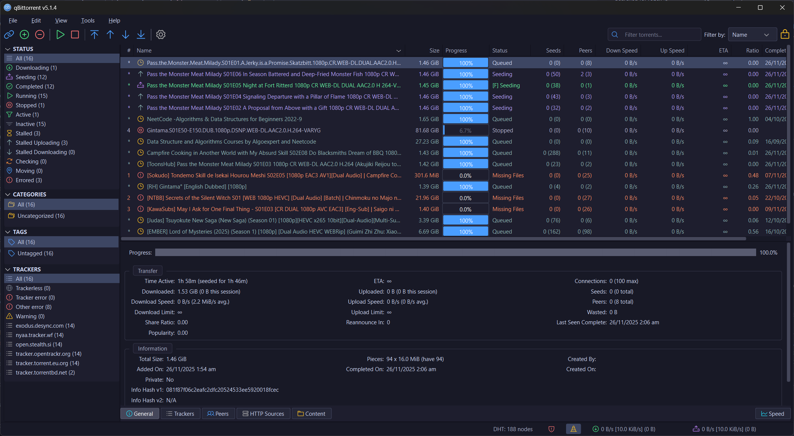

# Nova Dark Theme for qBittorrent

A modern, carefully crafted dark theme for qBittorrent featuring a refined color palette, semantic status colors, and a custom icon set.



## Features

- 🎨 **Modern Dark Palette** – Deep, easy-on-the-eyes background with excellent contrast
- 🚦 **Semantic Status Colors** – Distinct colors for each torrent state (downloading, seeding, stalled, error, etc.)
- 🎯 **90+ Custom Icons** – Phosphor icon set with meaningful color coding
- ✨ **Polished UI** – Consistent styling across all widgets, dialogs, and panels

## Install

1. Download `nova-dark.qbtheme` from the [Releases](https://github.com/ehsan18t/qbt-theme/releases) page
2. In qBittorrent, go to **Tools → Options → Behavior**
3. Enable **Use custom UI Theme**
4. Browse to the downloaded `.qbtheme` file
5. Click **Apply**, then **OK**
6. Restart qBittorrent

## Build from Source

```bash
docker compose run --rm build
```

That's it — no local toolchain required, and it works the same on Windows, macOS and Linux. The image is built automatically on first run.

The result is `dist/nova-dark.qbtheme`.

## Local Build (without Docker)

The container is only a toolchain wrapper — `scripts/build.sh` is the actual build, and both paths run that same script. To run it directly you need two things on `PATH`:

| Tool | What it does | Provided by |
| ---- | ------------ | ----------- |
| `qtsass` | Compiles the SCSS sources to Qt-flavoured QSS | `pip install qtsass` |
| `rcc` | Packs the stylesheet, icons and config into a `.qbtheme` | Qt 5 base tools |

Python 3.8+ is also required (it drives `src/make-resource.py`).

### Setup

**Linux (Debian/Ubuntu)**

```bash
sudo apt install python3 python3-pip qtbase5-dev-tools
pip install qtsass
```

**macOS**

```bash
brew install qt@5
pip3 install qtsass
export PATH="$(brew --prefix qt@5)/bin:$PATH"   # puts rcc on PATH
```

**Windows**

Install [Python](https://www.python.org/downloads/), then:

```bash
pip install qtsass
```

`rcc` is not on PATH by default. This repo ships `src/tools/rcc.exe`, which `make-resource.py` falls back to automatically — so nothing further is needed. To use your own Qt build instead, point `QBT_THEME_RCC` at it:

```bash
set QBT_THEME_RCC=C:\Qt\5.15.2\msvc2019_64\bin\rcc.exe
```

Run the build from Git Bash or WSL, since `build.sh` is a shell script. There is intentionally no `.bat` twin — keeping a second copy of the build logic in sync is what previously let the Windows path silently package a stale stylesheet.

### Build

```bash
./scripts/build.sh
```

The script checks its own prerequisites and tells you what is missing rather than failing halfway through. Pass `-v` to `make-resource.py` if you want the full list of embedded resources instead of a summary.

<details>
<summary>Regenerating icons</summary>

Icons come from [Phosphor](https://phosphoricons.com/) and are checked in, so a normal build never touches the network. To refetch or recolor them (needs Python 3.10+ and an internet connection):

```bash
python src/nova-dark/scripts/download_phosphor_icons.py
```

Useful flags: `--weight <thin|light|regular|bold|fill|duotone>`, `--mono` with `--color <hex>` for a single-color set.

</details>

## Status Colors

| Status            | Color      |
| ----------------- | ---------- |
| Downloading       | 🔵 Blue     |
| Uploading/Seeding | 🟢 Green    |
| Forced            | 🟠 Orange   |
| Stalled           | ⚪ Gray     |
| Queued            | 🟣 Lavender |
| Error/Missing     | 🔴 Red      |

## License

MIT License
