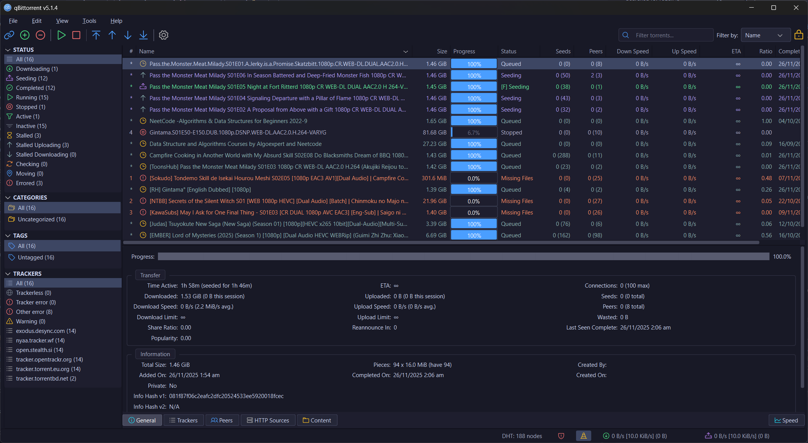

# Nova Dark Theme for qBittorrent

A modern, carefully crafted dark theme for qBittorrent featuring a refined color palette, semantic status colors, and a custom icon set.



## Features

- 🎨 **Three palettes** – Nebula (violet on navy), Graphite (near-neutral, blue accent), Slate (blue-slate, teal accent)
- 🎯 **Two icon treatments** – Semantic colour, or monochrome so colour on screen means torrent state and nothing else
- 🚦 **Semantic status colors** – Distinct colors for each torrent state, identical in every variant so the legend never changes
- ✨ **Polished UI** – Consistent styling across every widget, dialog and panel

Every combination is built, so there are **6 themes** to choose from.

## Install

1. Download a `.qbtheme` from the [Releases](https://github.com/ehsan18t/qbt-theme/releases) page
2. In qBittorrent, go to **Tools → Options → Behavior**
3. Enable **Use custom UI Theme**
4. Browse to the downloaded `.qbtheme` file
5. Click **Apply**, then **OK**
6. Restart qBittorrent

### Which file?

Files are named after the choices that actually vary, so today that is `nova-dark-<palette>-<icons>.qbtheme`. An axis with only one value is left out of the name; add a second density and it reappears in all of them. Plain `nova-dark.qbtheme` is Nebula + colour, the recommended starting point and the same file the older instructions pointed at.

| Pick | If you want |
| ---- | ----------- |
| `nebula` | The original Nova Dark identity: violet accent on cool navy |
| `graphite` | Near-neutral greys. The quietest of the three; the transfer list is the only colour on screen |
| `slate` | Softer blue-slate with a teal accent and the widest separation between panes |
| `colour` | Icons keep their semantic hue: downloads green, errors red, trackers orange |
| `mono` | Every icon in one neutral, so the sidebar stops competing with the list it filters |

## Build from Source

```bash
docker compose run --rm build
```

That's it. No local toolchain required, and it works the same on Windows, macOS and Linux. The image is built automatically on first run.

The result is all 6 themes in `dist/`, plus `nova-dark.qbtheme` as an alias for the recommended combination. A full build takes a couple of seconds, and it is not 6x the work: a stylesheet depends only on palette and density, a config only on palette, and an icon set only on palette and treatment, so each is produced once and shared.

To build a subset while iterating, restrict an axis:

```bash
python scripts/build.py --only palette=nebula --only icons=mono
python scripts/build.py --list        # print the matrix without building
```

## Local Build (without Docker)

The container is only a toolchain wrapper. `scripts/build.py` is the actual build, and every path runs that same file. To run it directly you need:

| Tool | What it does | Provided by |
| ---- | ------------ | ----------- |
| Python 3.8+ | Runs the build itself | [python.org](https://www.python.org/downloads/) |
| `qtsass` | Compiles the SCSS sources to Qt-flavoured QSS | `pip install qtsass` |
| `rcc` | Packs the stylesheet, icons and config into a `.qbtheme` | Qt 5 base tools |

`qtsass` is imported, not called as a command, so it does not need to be on `PATH`. Installing it for the Python you build with is enough.

### Setup

**Linux (Debian/Ubuntu)**

```bash
sudo apt install python3 python3-pip qtbase5-dev-tools
pip install qtsass
```

**macOS**

```bash
brew install qt@5
pip3 install qtsass
export PATH="$(brew --prefix qt@5)/bin:$PATH"   # puts rcc on PATH
```

**Windows**

Install [Python](https://www.python.org/downloads/), then:

```bat
py -m pip install qtsass
```

`rcc` is not on PATH by default. This repo ships `src/tools/rcc.exe`, which `make-resource.py` falls back to automatically, so nothing further is needed. To use your own Qt build instead, point `QBT_THEME_RCC` at it:

```bat
set QBT_THEME_RCC=C:\Qt\5.15.2\msvc2019_64\bin\rcc.exe
```

Then **double-click `scripts\build.bat`**. Python is the only thing it needs: no Docker, no Git Bash, no WSL. It keeps the window open so you can read any errors, and drops the result in `dist\`.

`build.bat` and `build.sh` are both thin launchers that locate a Python and hand over to `build.py`, which is the single build implementation on every platform. Neither launcher contains build logic, so there is nothing to drift: keeping a second copy in sync is what previously let the Windows path silently package a stale stylesheet.

### Build

```bat
scripts\build.bat           :: Windows, or just double-click it
```

```bash
./scripts/build.sh          # macOS, Linux
python scripts/build.py     # anywhere, if you prefer
```

The script checks its own prerequisites and tells you what is missing rather than failing halfway through. Pass `-v` to `make-resource.py` if you want the full list of embedded resources instead of a summary.

<details>
<summary>Regenerating icons</summary>

Icons come from [Phosphor](https://phosphoricons.com/) and are checked in, so a normal build never touches the network.

The checked-in files are **geometry, not colour**. They carry a placeholder fill and are recoloured per variant at build time, which is why one set of 91 files serves all three palettes and both icon treatments, and why adding an icon treatment never needs a download. If you ever see flat grey `#808080` icons in a packed theme, the recolour step was skipped.

You only need to refetch when changing the icon weight or adding a new icon (needs Python 3.10+ and an internet connection):

```bash
python src/nova-dark/scripts/download_phosphor_icons.py --weight regular
```

To change icon *colours*, edit the `$icon-` values in a palette fragment, or add a treatment under `src/nova-dark/source/icons/`. Neither touches the network.

</details>

## Status Colors

Identical in all three palettes, on purpose. A state colour is a legend, not decoration: if each palette invented its own green, switching palette would mean relearning the transfer list.

| Status            | Color      |
| ----------------- | ---------- |
| Downloading       | 🔵 Blue     |
| Uploading/Seeding | 🟢 Green    |
| Forced            | 🟠 Orange   |
| Stalled           | ⚪ Gray     |
| Queued            | 🟣 Violet   |
| Error/Missing     | 🔴 Red      |

This is also why the chrome accent and the "queued" colour are separate: Graphite's accent is blue and Slate's is teal, either of which would be indistinguishable from Downloading or Checking in the one column where those have to stay apart.

## Adding your own variant

A palette, a density or an icon treatment is one fragment file plus one line in `src/nova-dark/variants.json`. The build discovers the files and fails if they disagree with that list, in either direction, so a half-finished palette cannot become a shipped theme by accident. See [`src/nova-dark/README.md`](src/nova-dark/README.md).

## License

MIT License
